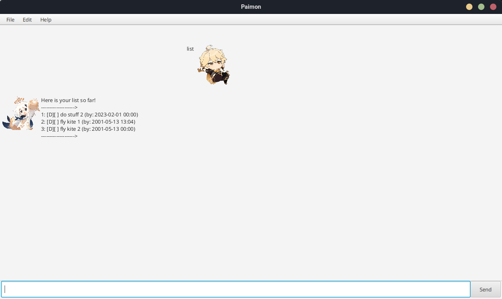

# Paimon User Guide

Paimon is a versatile task manager designed to help you keep track of your tasks efficiently. With a user-friendly graphical user interface (GUI), Paimon simplifies task management, allowing you to add, delete, mark tasks as done or undone, and search for tasks with ease. Below is a comprehensive guide to Paimon's features, ensuring you get the most out of your task manager.

## List Tasks

**Description:** Displays all your tasks in a list.

**Usage Example:** `list`

**Expected Outcome:**

    1. [T][ ] Read a book
    2. [D][X] Submit assignment (by: 2022-01-01)
    3. [E][ ] Project meeting (from: 2022-01-01 to: 2022-01-01)

## Add a Todo Task

**Description:** Adds a task without any deadline.

**Usage Example:** `todo Read a book`

**Expected Outcome:**

    Added: [T][ ] Read a book

## Add a Deadline

**Description:** Adds a task with a deadline.

**Usage Example:** `deadline Submit assignment /by 2022-03-04`

**Expected Outcome:**

    Added: [D][ ] Submit assignment (by: 2022-03-04)

## Add an Event

**Description:** Adds a task with a start and end time.

**Usage Example:** `event Project meeting /from 2022-04-04 /to 2022-04-05`

**Expected Outcome:**

    Added: [E][ ] Project meeting (from: 2022-04-03 to: 2022-04-05)

## Mark a Task as Done

**Description:** Marks a task as completed.

**Usage Example:** `mark 2`

**Expected Outcome:**

    Okay Traveller, I've marked the task as done:
    [D][X] Submit assignment (by: 2023-03-02)

## Unmark a Task

**Description:** Marks a completed task as not done.

**Usage Example:** `unmark 2`

**Expected Outcome:**

    Okay Traveller, I've marked the task as not done
    Marked as not done: [D][ ] Submit assignment (by: 2023-03-02)

## Delete a Task

**Description:** Deletes a task from your list.

**Usage Example:** `delete 1`

**Expected Outcome:**

    Okay Traveller, I've deleted the task! You now have 5 tasks remaining.

## Find Tasks by Keyword

**Description:** Lists all tasks that contain a specific keyword.

**Usage Example:** `find book`

**Expected Outcome:**

    Okay Traveller, here are the matching tasks
    [D][X] Finish Project (by: 2022-01-04)
    [T][ ] Do Project

## Exit the Program

**Description:** Safely exits Paimon.

**Usage Example:** `bye`

**Expected Outcome:**

    Goodbye! Hope to see you again soon!

## Add a Task with a Start Time

**Description:** Adds a task that must be started after a specific time.

**Usage Example:** `doafter Email professor /from 2022-01-01`

**Expected Outcome:**

    Added: [T][ ] Email professor (after: 2022-01-01)

This user guide aims to make your experience with Paimon as smooth and productive as possible. Whether you're managing daily tasks or planning for future events, Paimon is here to assist you every step of the way.
